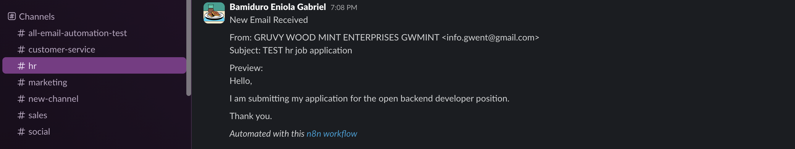
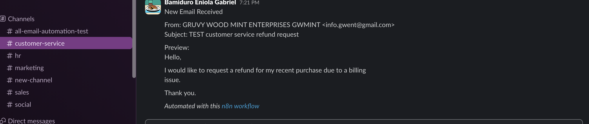
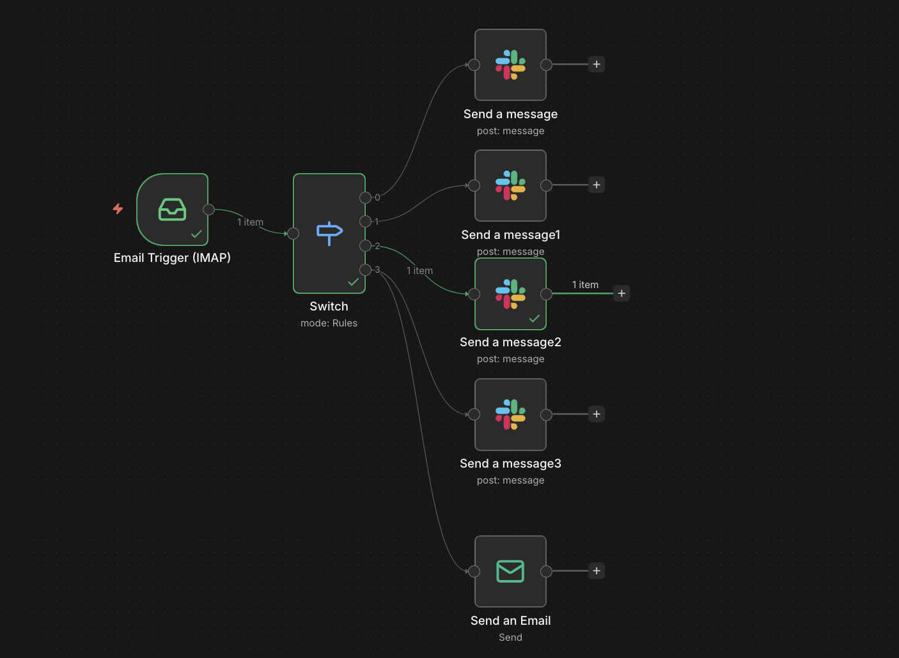

# Email Management Automation Workflow (n8n)

## Overview

This project contains an n8n workflow that automates internal email management for a company. Incoming emails are categorized by department and routed to the appropriate Slack channel. Emails categorized under Customer Service also receive an automatic acknowledgement reply.

This workflow demonstrates trigger handling, conditional routing, data mapping, and multi-branch execution using n8n.

---

## Workflow Architecture

Email Trigger (IMAP)  
→ Switch Node (Department Categorization)  
→ Slack Notification (per department)  
→ Customer Service branch → Acknowledgement Email (SMTP)

---

## Features

- Email trigger using IMAP
- Subject-based categorization into:
  - Sales
  - Marketing
  - Human Resources (HR)
  - Customer Service
- Slack notification to the correct department channel
- Conditional email acknowledgement for Customer Service only
- Proper branching to preserve original email context
- Dynamic field mapping using n8n expressions

---

## How It Works

1. A new email is received in the company inbox.
2. The workflow analyzes the email subject using a Switch node.
3. Based on keyword matching, the email is routed to the appropriate department.
4. A Slack message is sent to the relevant channel including:
   - Sender
   - Subject
   - Short message preview
5. If categorized as Customer Service, an acknowledgement email is sent back to the sender confirming receipt.

The workflow ensures that not all emails receive automatic replies. Only Customer Service emails trigger a response.

---

## Technologies Used

- n8n
- Gmail (IMAP for receiving, SMTP for sending)
- Slack

---

## Testing Scenarios

The workflow was tested using the following sample subjects:

- TEST sales pricing inquiry
- TEST marketing campaign proposal
- TEST hr job application
- TEST customer service refund request

Each test confirmed:

- Correct Slack routing
- No cross-department notifications
- Customer Service acknowledgement email sent successfully

---

## Setup Requirements

To use this workflow:

1. Configure IMAP credentials for receiving emails.
2. Configure SMTP credentials for sending acknowledgement emails.
3. Connect Slack using OAuth.
4. Adjust keyword rules inside the Switch node if needed.

Credentials are not included in this repository.

---

## Screenshots

### Workflow Canvas

  

---

### Slack Notifications

  
  

  
  

---

### Customer Service Acknowledgement Email

  

---

### Execution Logs

  
  

---

## Author

Bamiduro Gabriel Eniola (GBT3K)
